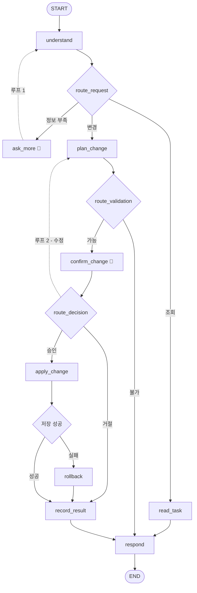

# 기획서 — 가상 금융 업무 AI Agent

| 항목 | 내용 |
|---|---|
| 프로젝트명 | `langgraph-financial-agent` |
| 한 줄 설명 | 자연어로 받은 은행 업무 요청을, **승인 절차를 거쳐** 실제 데이터 변경까지 처리하는 AI Agent |
| 핵심 기술 | LangGraph (State · 조건부 Edge · `interrupt` · Checkpointer) |
| 작성일 | 2026-09-22 |
| 문서 성격 | **잘 안 바뀌는 문서.** 무엇을 왜 만드는가. 만드는 순서는 [구현계획.md](구현계획.md) 참고 |

---

## 1. 무엇을 만드는가

은행 앱의 계좌 조회·이체·카드 관리 기능을, **버튼 대신 말로** 쓰는 에이전트를 만든다.

```
사용자: "생활비에서 저축으로 10만 원 옮겨줘"
   ↓
에이전트: "생활비 → 저축으로 100,000원을 이체합니다.
          생활비: 520,000 → 420,000원
          진행할까요?"
   ↓
사용자: "응, 진행해"
   ↓
에이전트: "이체를 완료했습니다."   ← 이 시점에 JSON 파일이 실제로 바뀐다
```

---

## 2. 이 프로젝트의 진짜 주제

기능을 많이 만드는 것이 목표가 **아니다.** 과제 명세가 요구하는 핵심은 하나다.

> 변경할 내용을 보여주고 **LangGraph의 중단·재개로** 승인 또는 거절을 받는다.

즉 이 프로젝트의 중심은 **Human-in-the-Loop**(사람이 중간에 개입하는 흐름)이고,
나머지 기능들은 그 흐름이 제대로 도는지 확인하기 위한 재료다.

따라서 설계의 성공 기준은 이렇다.

> **업무를 몇 개 추가하든, 승인 흐름(그래프)은 그대로일 것.**

---

## 3. 목표와 비목표

### 목표

| # | 목표 | 확인 방법 |
|---|---|---|
| 1 | 자연어 요청을 의도와 파라미터로 해석한다 | "생활비에서 저축으로 10만원" → `intent=transfer`, 계좌 2개, 금액 |
| 2 | 조회 요청은 승인 없이 바로 답한다 | "내 계좌 보여줘" → 즉시 목록 출력 |
| 3 | 변경 요청은 **반드시 승인을 거친다** | 승인 전에는 JSON 파일이 1바이트도 안 바뀜 |
| 4 | 거절·수정·실패 시 데이터가 그대로다 | 거절 후 잔액 조회 시 변화 없음 |
| 5 | 업무 추가 시 그래프를 수정하지 않는다 | 카드 잠금 추가 시 `functions.py`만 변경 |

### 비목표 (범위 밖)

**안 만드는 것을 명시해두는 이유**: 나중에 "이것도 해야 하나?" 하고 흔들리지 않기 위해서다.

| 안 만드는 것 | 이유 |
|---|---|
| 로그인·회원가입 (인증) | `CURRENT_USER_ID = "user_01"` 상수로 대체. 본 과제의 주제가 아님 |
| 실제 은행 API 연동 | 로컬 JSON 파일이 데이터베이스 역할 |
| 실제 카드 제작·배송 처리 | 명세에서 명시적으로 제외 |
| 웹 UI | CLI 대화 루프로 충분. 음성은 [8. 향후 확장](#8-향후-확장) 참고 |
| 동시 접속 처리 | 사용자 한 명이 순차적으로 쓰는 것을 전제 |

> **인가(authorization)는 구현한다.** 인증(너 누구야)은 생략하지만,
> "내 계좌만 조회·변경한다"는 소유자 필터링은 넣는다.
> 초기 데이터에 **다른 소유자의 같은 별명 계좌**(user_02의 "생활비")를 일부러 심어뒀기 때문이다.

---

## 4. 구현 범위 — 3단계로 나눈다

### 1차 (지금 목표)

| 기능 | 종류 | 왜 이걸 먼저 |
|---|---|---|
| 계좌 목록·잔액 조회 | 조회 | 승인 없는 짧은 경로를 먼저 완성 |
| 즉시이체 | 변경 | 승인 흐름의 대표 사례. 검증 조건이 가장 풍부 |
| 카드 일시 잠금 | 변경 | **계좌가 아닌 다른 데이터**를 건드림 → Handler 구조가 진짜 되는지 검증 |

> 카드 잠금을 1차에 넣은 이유가 핵심이다.
> 이체만 만들면 Handler가 하나뿐이라 "업무를 추가해도 그래프가 안 바뀐다"를 **증명할 수 없다.**
> 성격이 다른 업무 두 개가 같은 그래프를 타야 설계가 검증된다.

### 2차

- 잔액 합산, 거래 내역 조회 (기간·금액·유형 필터)
- 조건부 이체 ("40만원 남기고 나머지")
- 청구서 조회·납부
- 카드 분실 정지 / 잠금 해제
- 정보 부족 시 되묻기, 승인 전 수정

### 3차

- 여러 계좌로 나눠 이체 (원자성 보장)
- 일괄 납부 (건별 처리, 실패 시 중단)
- 카드 재발급 신청·조회·수정·취소
- 정지 후 재발급 (승인 2회 연쇄)
- **재시작·장애 복구** ← Checkpointer를 Sqlite로 교체하는 시점
- 후속 결과 조회 ("아까 이체 됐어?")

---

## 5. 설계 원칙

이 프로젝트에서 판단이 갈릴 때 따르는 기준. 근거는 [devlog/2026-09-22](../devlog/2026-09-22_워크플로우-설계-이해.md)에 상세히 기록.

### 원칙 1 — 노드는 "단계"를 표현하고, "업무"를 표현하지 않는다

노드 이름에 `transfer`, `card` 같은 업무명을 넣지 않는다.
업무 종류는 State의 `intent` 필드가 들고 있고, 그래프는 절차만 안다.

### 원칙 2 — 데이터를 바꾸는 곳은 단 한 군데다

`data_store.save()`를 호출하는 노드는 `apply_change` 하나뿐이다.
`read_task`와 `plan_change`는 읽기만 한다.

> 조회 노드는 `save`를 **import조차 하지 않는다.** 실수로든 아니든 망가뜨릴 방법 자체를 없앤다.

### 원칙 3 — 승인 전에는 아무것도 바꾸지 않는다

`plan_change`는 "무엇을 바꿀지"만 정하고 데이터는 건드리지 않는다.
`interrupt`가 그래프를 완전히 멈추는 방식으로 동작하므로,
계획과 실행은 **물리적으로 다른 노드**여야 한다.

### 원칙 4 — 실행 직전에 다시 검증한다

승인을 기다리는 사이 잔액이 바뀔 수 있다 (TOCTOU).
`apply_change`는 저장 전에 검증을 한 번 더 돌린다.

### 원칙 5 — 모든 길은 하나의 출구로 모인다

성공·실패·거절 어느 경로든 `respond` → `END`로 나간다.
`END`는 하나다. 응답 생성이 한 곳에 모여야 말투와 형식이 일관된다.

---

## 6. 시스템 구조

```
langgraph-financial-agent/
├── data/
│   ├── initial_data.json   원본 (읽기 전용, git으로 관리)
│   └── bank_data.json      작업용 복사본 (실행 중 변경, git 제외)
├── src/
│   ├── main.py             CLI 입력 루프, 중단/재개 처리
│   ├── graph.py            State 정의, 노드 9개, 조건부 Edge 4개
│   ├── functions.py        업무별 조회 함수와 변경 Handler
│   └── data_store.py       JSON 복사·읽기·저장 (유일한 파일 접근 통로)
├── docs/                   기획서, 구현계획
└── devlog/                 세션별 개발일지 (설계 결정의 근거)
```

### 워크플로우



🛑 표시가 `interrupt`로 멈추는 지점이다. 노드 9개, 조건부 Edge 4개, 루프 2개.

### 저장소가 두 개라는 점 (중요)

| 저장소 | 담는 것 | 프로그램을 꺼도 남나 |
|---|---|---|
| `data/bank_data.json` | 계좌 잔액, 거래 내역, 카드 상태, 처리 기록 | **남는다** |
| Checkpointer | 대화 맥락, 승인 대기 중인 처리안 | 1차는 메모리 → 사라짐 |

**은행 데이터는 Checkpointer와 무관하다.** `apply_change`가 직접 JSON에 쓰기 때문이다.
1차에서 `InMemorySaver`를 써도 이체한 잔액은 그대로 남는다.
사라지는 것은 "승인 질문에 아직 답하지 않은 상태" 뿐이며, 이는 3차의 재시작 복구에서 해결한다.

---

## 7. 데이터 구조

`data/initial_data.json`의 최상위 키 7개.

| 키 | 개수 | 비고 |
|---|---|---|
| `accounts` | 5 | user_01 4개 + user_02 1개 |
| `cards` | 4 | 전부 체크카드(`debit`), 초기 상태 `active` |
| `transactions` | 20 | 2026년 8~9월 분포 |
| `addresses` | 2 | 집 / 회사 |
| `bills` | 5 | 전부 미납(`unpaid`) |
| `requests` | 0 | 처리 기록이 쌓이는 곳 |
| `reissue_applications` | 0 | 재발급 신청이 쌓이는 곳 |

### 초기 데이터에 일부러 심어둔 상황

테스트하고 싶은 케이스를 데이터에 미리 넣어뒀다. 이를 **fixture**(고정 테스트 데이터)라 한다.

| 심어둔 것 | 무엇을 테스트하려고 |
|---|---|
| user_01과 user_02가 **똑같이 "생활비"** 계좌 보유 | 별명만으로 계좌를 특정할 수 없는 상황 → 소유자 필터링 |
| 비상금 계좌 75,000원 | 잔액 부족 |
| 생활비 520,000원 | 조건부 이체("40만원 남기고") 시 이체액 120,000원 계산 |
| 저축 1,850,000원 | 이체 한도(100만원) 초과 |
| 보험료 납기일 2026-09-20 | 기한이 지난 청구서 납부 |
| 5만원 이상 카드 결제 5건 | 금액 조건 거래 내역 조회 |

### 상태 값 정의

명세에서 "구현에 맞게 정의한다"고 한 값들.

| 대상 | 값 | 뜻 |
|---|---|---|
| `cards.status` | `active` | 사용 가능 |
| | `locked` | 일시 잠금 (해제 가능) |
| | `reported_lost` | 분실 정지 (해제 불가, 재발급 대상) |
| `bills.status` | `unpaid` / `paid` | 미납 / 납부 완료 |
| `requests.status` | `completed` / `failed` / `cancelled` | 처리 완료 / 실패 / 사용자 취소 |

---

## 8. 향후 확장

### 음성 입력

Gemini는 오디오 파일을 직접 입력으로 받는다 (MP3/WAV/FLAC, 오디오 1초 = 입력 토큰 32개).
실시간 대화가 필요하면 Live API라는 별도 방식이 있다.

**중요한 점: 음성을 붙여도 그래프는 하나도 바뀌지 않는다.**

```
[지금]   터미널 입력(문자열) ──┐
                               ├──> understand 노드 ──> (이하 동일)
[나중에] 마이크 → Gemini → 문자열 ─┘
```

`main.py`의 입력부만 교체하면 되는 일이다.
설계 원칙 5(입구와 출구를 하나로 좁힘) 덕분에 얻는 이득.

### 그 외

- 웹 UI (FastAPI + 간단한 프론트)
- 다중 사용자 지원 (인증 추가)
- 거래 메모(적요) 수정, 대표 계좌 자동 지정, 이체 한도 설정

---

## 9. 제출물 대응표

| 제출물 | 어디에 있나 | 상태 |
|---|---|---|
| 실행 코드 | `src/` | 구현 중 |
| README | `README.md` | 미작성 |
| 설계 초안 | FigJam 손그림 (AI 없이 직접 작성) | 완료 |
| 최종 설계 자료 | 이 문서 + `devlog/` | 작성 중 |
| 회고 | `docs/회고.md` | 미작성 |

> 과제 규칙상 **설계 초안은 AI 없이 직접 작성**해야 한다.
> FigJam으로 직접 그린 것을 초안으로 제출하고,
> 이 문서와의 차이를 "최종 설계 자료의 변경 이유"로 정리한다.

---

## 10. 참고

| 자료 | 위치 |
|---|---|
| 과제 명세 | https://ucanlabs.kr/classroom/aicampus-agent-python/lesson/1225/ |
| uv 사용법 | https://ucanlabs.kr/classroom/aicampus-agent-python/lesson/1224/ |
| 기능 목록 원본 | [가상금융업무ai에이전트.md](../가상금융업무ai에이전트.md) |
| 설계 결정 근거 | [devlog/2026-09-22](../devlog/2026-09-22_워크플로우-설계-이해.md) |
| 구현 순서 | [구현계획.md](구현계획.md) |
