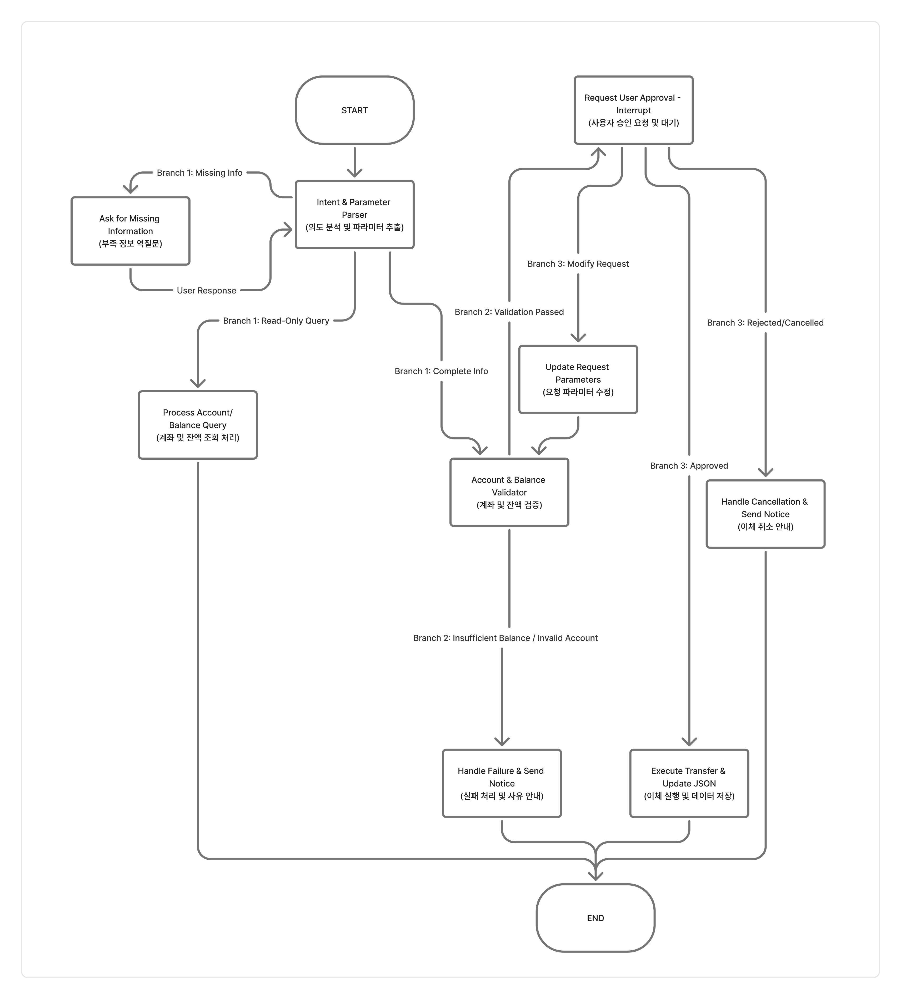

# 설계 초안 — 코딩 전에 그린 워크플로우

| 항목 | 내용 |
|---|---|
| 작성일 | 2026-09-22 |
| 도구 | FigJam |
| 그림 | [images/00-design-draft.png](images/00-design-draft.png) |
| 이후 바뀐 내용 | [설계변경기록.md](설계변경기록.md) A장 |



---

## 흐름

```
START → Intent & Parameter Parser (의도 분석 및 파라미터 추출)
  ├ Missing Info     → Ask for Missing Information → (User Response) → Parser로 되돌아감
  ├ Read-Only Query  → Process Account/Balance Query → END
  └ Complete Info    → Account & Balance Validator
                        ├ Insufficient Balance / Invalid Account → Handle Failure & Send Notice → END
                        └ Validation Passed → Request User Approval (Interrupt)
                                               ├ Approved           → Execute Transfer & Update JSON → END
                                               ├ Rejected/Cancelled → Handle Cancellation & Send Notice → END
                                               └ Modify Request     → Update Request Parameters → Validator로 되돌아감
```

| 분기 | 어디서 | 갈래 |
|---|---|---|
| Branch 1 | `Intent & Parameter Parser` 다음 | 정보 부족 / 단순 조회 / 정보 완비 |
| Branch 2 | `Account & Balance Validator` 다음 | 검증 통과 / 잔액 부족·계좌 오류 |
| Branch 3 | `Request User Approval` 다음 | 승인 / 거절·취소 / 조건 수정 |

**루프 2개**
- 정보가 부족하면 되묻고, 답을 받아 다시 해석한다.
- 승인 단계에서 조건을 고치면 파라미터를 수정하고 다시 검증한다.

---

## 검토

**잘된 점**
- 해석(`Parser`)을 맨 앞 한 곳에 둬서, 자연어를 구조화된 값으로 바꾸는 일이 흩어지지 않는다.
- 데이터를 바꾸기 전에 승인 단계(`Interrupt`)를 둬서 과제의 핵심을 짚었다.
- 조건 수정 → 재검증 루프가 닫혀 있어서, 고친 값도 다시 검증을 거친다.
- 모든 경로가 `END` 하나로 끝난다.

**부족한 점** (v1에서 보완)
- 노드 이름에 업무명(`Transfer`)이 들어가 있어서, 카드 잠금 같은 업무를 추가하면 그래프를 또 그려야 한다.
- 실패·취소 노드가 각자 안내 문장을 만들어서, 응답 말투가 경로마다 달라질 수 있다.
- 사용자 답변을 받는 부분이 화살표(`User Response`)로만 있어서, 어디서 멈추고 어떻게 이어 가는지가 없다.
- 저장에 실패했을 때의 경로가 없다.
- 처리 결과(성공·실패·취소)를 기록하는 곳이 없어서, "아까 이체 됐어?" 같은 후속 조회에 답할 근거가 없다.
- 승인 직전에만 검증해서, 승인을 기다리는 사이 잔액이 바뀌면 잡지 못한다.

각 항목을 어떻게 바꿨는지는 [설계변경기록.md](설계변경기록.md) A장에 있다.
