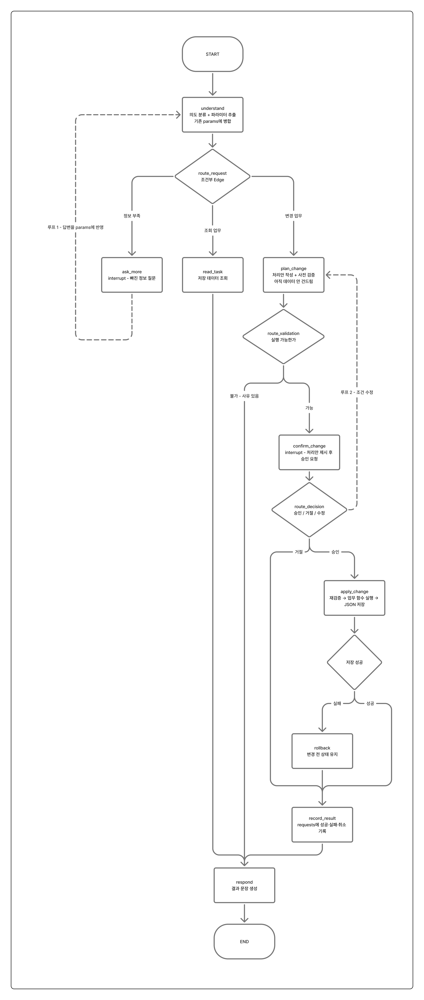
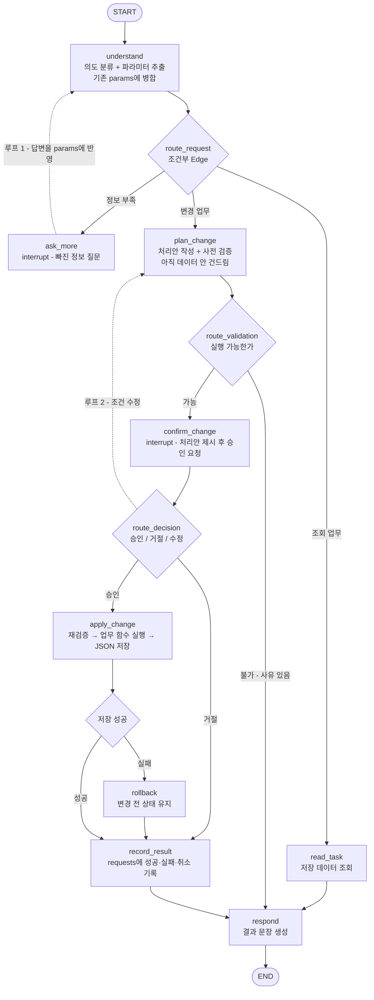

# 설계 초안 — v1 워크플로우

| 항목 | 내용 |
|---|---|
| 작성일 | 2026-09-22 (코딩 전) |
| 그림 | [images/00-design-v1.png](images/00-design-v1.png) |
| 이 문서의 범위 | 흐름도 · 주요 State 필드와 변경 시점 · 분기 조건 · 구성 근거 |
| 이 초안이 나오기까지 | 아래 [과정: 처음 구상에서 v1까지](#과정-처음-구상에서-v1까지) |
| 이후 바뀐 내용 | [설계변경기록.md](설계변경기록.md) B장 |



---

## 흐름



**구성**: 노드 9개 · 조건부 Edge 4개 · 루프 2개 · 중단 지점 2개 · `END` 1개

| 노드 | 한 줄 설명 |
|---|---|
| `understand` | 사용자 말을 의도와 파라미터로 바꾸고, 부족한 정보를 표시 |
| `ask_more` | 부족한 정보를 질문하고 **멈춤**(`interrupt`) |
| `read_task` | 데이터를 읽어 조회 결과를 만듦 (아무것도 안 바꿈) |
| `plan_change` | 처리안을 짜고 실행 가능한지 검증 (아직 안 바꿈) |
| `confirm_change` | 처리안을 보여주고 **멈춤**(`interrupt`), 응답을 3갈래로 분류 |
| `apply_change` | 한 번 더 검증한 뒤 실제로 바꾸고 JSON에 저장 |
| `rollback` | 저장 실패 시 변경 전 상태 유지를 보장하고 사유를 남김 |
| `record_result` | 성공·실패·취소를 `requests` 배열에 기록 |
| `respond` | 결과를 사람이 읽을 문장으로 만듦 |

---

## 주요 State 필드와 변경 시점

State는 노드들이 주고받는 데이터 보따리다.

| 필드 | 담는 것 | 채워지는 곳 | 비워지는 곳 |
|---|---|---|---|
| `messages` | 대화 기록. 덮어쓰지 않고 누적 | 매 턴 (`understand`, `respond`) | — |
| `intent` | 업무 종류 (이체, 카드 잠금 등) | `understand` | 업무 완료 후 `respond` |
| `params` | 계좌, 금액 등 업무에 필요한 값. 이전 값과 병합 | `understand` | 업무 완료 후 `respond` |
| `missing` | 아직 모자란 값의 목록 | `understand` | `understand` (다시 들어오면 새로 계산) |
| `plan` | 승인을 기다리는 처리안 | `plan_change` | `record_result` |
| `decision` | 승인 / 거절 / 수정 중 사용자의 응답 | `confirm_change`가 재개될 때 | **재시작 직후** |
| `result` | 성공·실패와 사유 | `apply_change` / `rollback` | `respond` |
| `request_id` | 한 요청을 가리키는 번호. 후속 조회의 연결고리 | `plan_change` | `record_result` |
| `revision_count` | 승인 전에 조건을 고친 횟수 | `confirm_change`에서 수정할 때 | 새 요청 |

**`decision`을 재시작할 때 반드시 비우는 이유**: 명세에 "이전 승인만으로 변경을 자동 실행하지 않는다"는 조건이 있다. 재시작 후 State가 복원될 때 `decision`이 승인으로 남아 있으면 사람이 확인하지 않아도 이체가 실행된다.

---

## 분기 조건

마름모(조건부 Edge)는 State를 바꾸지 않고 어떤 값을 보고 다음 노드만 정한다.

| 이름 | 어디서 | 보는 값 | 갈래 |
|---|---|---|---|
| `route_request` | `understand` 다음 | `missing`이 비었는지, `intent`가 조회 계열인지 | `ask_more` / `read_task` / `plan_change` |
| `route_validation` | `plan_change` 다음 | `plan`이 만들어졌는지, 실패 사유가 담겼는지 | `confirm_change` / `respond` |
| `route_decision` | `confirm_change` 다음 | `decision` | `apply_change` / `record_result` / `plan_change` |
| `route_save` | `apply_change` 다음 | `result.ok`가 참인지 | `record_result` / `rollback` |

**루프 2개**

| 루프 | 경로 | 언제 도나 | 탈출 조건 |
|---|---|---|---|
| 루프 1 | `ask_more` → `understand` | 필요한 정보가 아직 부족할 때 | `missing`이 빌 때까지 |
| 루프 2 | `route_decision` → `plan_change` | 승인 전에 조건을 고칠 때 | `revision_count` 상한 (5회) |

---

## 구성 근거

### 왜 이런 모양인가

과제 명세는 조회 기능과 승인 후 데이터를 바꾸는 기능을 **하나의 업무 흐름**으로 연결하고, 승인을 LangGraph의 중단·재개(`interrupt`)로 처리하라고 요구한다. 이 흐름도는 그 두 요구를 뼈대로 삼았다. 사용자의 말을 가장 먼저 해석하고, 해석 결과에 따라 조회 ,변경 , 정보 부족 세 갈래로 나눈 뒤, 데이터를 바꾸는 갈래만 승인 단계를 지나게 했다. 조회는 아무것도 바꾸지 않으므로 승인이 필요 없고, 변경은 되돌리기 어려우므로 반드시 사람의 확인을 거친다는 구분이다.

해석(`understand`)을 맨 앞 한 곳에 둔 것은 모든 요청이 자연어로 들어오기 때문이다. "생활비에서 저축으로 10만 원 옮겨줘" 같은 말을 의도와 값으로 바꾸는 일을 한 노드에 모아 두면, 이후의 노드는 말투를 신경 쓰지 않고 구조화된 값만 다루면 된다. 필수 값이 빠진 요청은 명세의 "정보 부족 시 추가 질문" 요구에 따라 `ask_more`에서 멈춰 되묻고, 받은 답을 다시 `understand`에 넣어 이전에 알아낸 값과 합친다. 되묻는 일이 몇 번 반복돼도 앞에서 알아낸 금액이나 계좌가 사라지지 않게 하려는 것이다.

변경 업무에서는 검증을 두 번 한다. 승인을 받기 전에 `plan_change`에서 처리안을 만들며 먼저 검증하는 것은 실행할 수 없는 요청(잔액 부족, 없는 계좌)에 승인을 받으면 의미가 없기 때문이다. 승인을 받은 뒤 `apply_change`에서 한 번 더 검증하는 것은 사용자가 승인을 기다리는 사이에 잔액이 바뀔 수 있기 때문이며 승인 응답은 승인 , 거절 , 수정 세 가지로 갈린다. 수정은 `plan_change`로 돌려보내 바뀐 조건을 처음부터 다시 검증하게 했고 무한히 고치는 것을 막으려고 횟수 상한을 두었다.

저장에 실패하면 `rollback`으로 변경 전 상태를 유지한다는 명세 조건을 따랐다. 어떤 경로로 끝나든 성공 , 실패 , 취소는 `record_result`로 기록해 "아까 이체가 됐어?" 같은 후속 조회의 근거를 남기고 사용자에게 보여줄 문장은 `respond` 한 곳에서만 만든다. 그래서 `END`도 하나다. 결과의 종류는 노드가 아니라 State가 구분한다. 애초에 랭체인은 start와  end는 각각 한개이므로..


노드 이름에는 이체 같은 업무 이름을 넣지 않고 `plan_change`, `apply_change`처럼 단계 이름을 썼다. 업무 이름이 노드에 들어가면 카드 잠금이나 청구서 납부를 추가할 때 그래프를 다시 그려야 하지만 단계 이름이면 업무는 State의 `intent`와 업무별 코드가 구분하고 그래프는 그대로 둘 수 있다.

### 명세 요구사항과의 대응

| v1의 부분 | 대응하는 명세 요구사항 | 이렇게 한 이유 |
|---|---|---|
| `understand`를 맨 앞에 | 모든 요청 예시가 자연어 | 말을 의도와 값으로 바꾸는 일을 한 곳에 모은다 |
| `route_request`의 3갈래 | ①~③ 기능이 조회와 변경으로 나뉨 + ④ "정보 부족 안내 / 추가 질문" | 해석 직후 "값이 다 있나", "바꾸는 업무인가"로 나눈다 |
| `ask_more` → `understand` (루프 1) | ④ "필수 파라미터 미비 시 역질문" | 답을 받으면 다시 해석해야 값이 채워진다 |
| 조회는 승인 없이 `respond`로 | ④ 승인은 "데이터 변경 발생 시" | 바꾸지 않는 조회에는 승인이 필요 없다 |
| 승인 전 `plan_change`의 검증 | ① 이체 한도 초과 시 거절 안내 | 실행할 수 없는 요청은 승인 전에 걸러 낸다 |
| `confirm_change`의 `interrupt` | ④ "사용자에게 최종 확답 요청 (`interrupt` 처리)" | 명세가 방식까지 정해 둔 부분이다 |
| `route_decision`의 3갈래 | ④ "자연어 승인/취소", "승인 전 수정" | 승인 단계에서 나올 수 있는 답이 이 세 가지다 |
| 수정 → `plan_change` (루프 2) | ④ "조건 수정 시 반영 후 재검토" | 바뀐 값도 처음부터 다시 검증한다 |
| `apply_change`의 재검증 | 승인 대기 중 잔액이 바뀔 수 있음 | 실행 직전에 한 번 더 확인한다 |
| `rollback` | "검증이나 저장에 실패하면 변경 전 상태를 유지한다" | 저장 실패 경로를 따로 둔다 |
| `record_result` | ④ "아까 이체 성공했어?" 같은 후속 조회 | 결과를 기록으로 남긴다 |
| `decision`을 재시작 시 비움 | ④ "재시작 후에도 이전 State가 보존" + "이전 승인만으로 자동 실행하지 않는다" | 복원된 State에 승인이 남아 있어도 다시 확인받는다 |

---

## 과정: 처음 구상에서 v1까지

v1은 한 번에 나온 것이 아니라, 처음 구상한 흐름을 검토하고 다시 설계해서 나왔다.

### 처음 구상의 흐름

```
Start → Intent & Parameter Parser → Info Sufficiency Check
  ├ 정보 부족   → Clarification Question → Receive User Answer → (Parser로 되돌아감)
  ├ 단순 조회   → Query Processing → End: Query Result
  └ 정보 완비   → Account & Balance Validation → Transfer Validation Result
                   ├ 잔액 부족·계좌 오류 → Failure & Guidance → End: Transfer Failed
                   └ 검증 성공 → User Approval Request (Interrupt) → User Approval Response
                                  ├ 승인      → Transfer Execution & Save → End: Transfer Success
                                  ├ 거절·취소 → Cancellation Processing → End: Transfer Cancelled
                                  └ 조건 수정 → Parameter Modification → (Validation으로 되돌아감)
```

처음 구상에서는 경로마다 `End`가 따로 있었다(조회 결과 , 이체 실패 , 이체 성공 , 이체 취소).

### FigJam으로 정리한 그림


위 구상을 FigJam에 옮겨 그린 그림이다. 처음 구상과 달리 `END`가 하나로 모여 있고 사용자 답변 받기(`User Response`)가 노드가 아닌 화살표 라벨로 표시돼 있다. 노드 이름에 업무명(`Validator`, `Execute Transfer & Update JSON`)이 들어 있는 점은 같다.

### 검토

**잘된 점**
- 해석(`Parser`)을 맨 앞 한 곳에 둬서, 자연어를 구조화된 값으로 바꾸는 일이 흩어지지 않는다.
- 데이터를 바꾸기 전에 승인 단계(`Interrupt`)를 둬서 과제의 핵심을 짚었다.
- 조건 수정 -> 재검증 루프가 닫혀 있어서 고친 값도 다시 검증을 거친다.

**부족한 점** (v1에서 보완)
- 노드 이름에 업무명(`Transfer`)이 들어가 있어서, 카드 잠금 같은 업무를 추가하면 그래프를 또 그려야 한다.
- 처음 구상에는 `End`가 여러 개였다. LangGraph의 `END`는 하나뿐인 표식이라 하나로 모으고, 결과 구분은 State로 옮겨야 한다.
- 실패·취소 노드가 각자 안내 문장을 만들어서, 응답 말투가 경로마다 달라질 수 있다.
- 사용자 답변을 받는 부분이 노드(`Receive User Answer`) 또는 화살표로만 있어서 어디서 멈추고 어떻게 이어 가는지가 없다.
- 저장에 실패했을 때의 경로가 없다.
- 처리 결과(성공·실패·취소)를 기록하는 곳이 없어서, "아까 이체 됐어?" 같은 후속 조회에 답할 근거가 없다.
- 승인 직전에만 검증해서, 승인을 기다리는 사이 잔액이 바뀌면 잡지 못한다.

각 항목을 어떻게 바꿨는지는 [설계변경기록.md](설계변경기록.md) A장에 있다.
